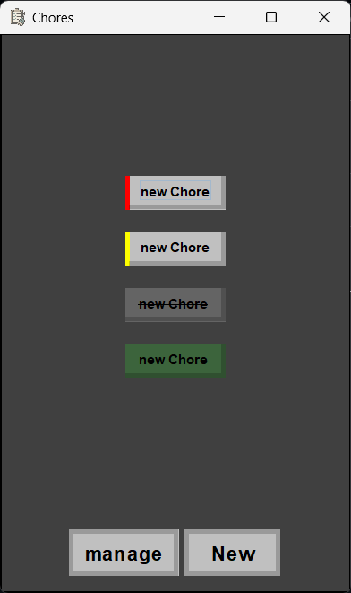
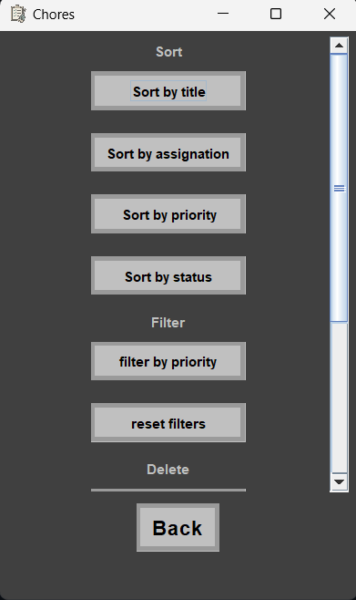
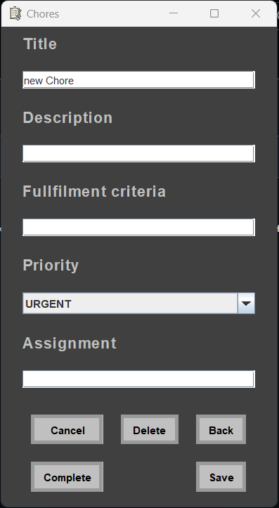

# ChoresApp

A simple Java application for managing household chores—keeping track of tasks, assignments, and completion status. Usable for roommates, families, or any shared living situation.

## Features

### Task Management
- Create, edit, and delete chores  
- Assign chores to users  
- Set chore priority  
- Filter chores by status, user, or priority  
- Remove completed or canceled chores  
- Export and import chores to/from CSV files

### User Management
- Add multiple users  
- Assign tasks to individuals

### Completion
- Mark chores as completed or canceled

##  Limitations
- Runs locally  
- No synchronization across devices
---

## Images

---

## Contributing

Contributions are welcome! Please fork the repo, make your changes, and submit a pull request. For big changes, open an issue first to discuss.

---

Enjoy managing chores more smoothly!
